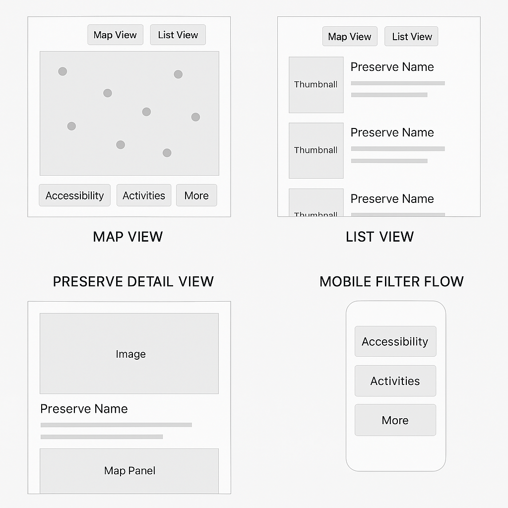

# ——— Preserve Explorer UX Wireframes (Structure Layouts)

*This page outlines the structural layout, component hierarchy, and interaction patterns of the Preserve Explorer tool. Designed as a lo-fi foundation for future visual and brand integration.*

---

### **🗺️ 1. Map View (Desktop + Mobile)**

**Purpose:**

Primary discovery interface showing all preserves spatially, overlaid on a Leaflet map.

**Layout Blocks:**

- Top toggle buttons: “Map View” / “List View”
- Filter bar (bottom fixed): Accessible ♿, Activities 🏃‍♀️, More ⚙️
- Map with interactive markers
- Popups with short preserve previews
- Responsive behavior:
    - Desktop: Full map with sidebar (when preserve is selected)
    - Mobile: Stack layout, popup opens full-width

**Key Components:**

- MapContainer (Leaflet)
- PreserveMarker (GeoJSON or individual points)
- FilterBar (3-category icon tabs)
- PopupPreviewCard

**Interaction Flow:**

1. User scrolls/zooms map
2. Filters update visible preserves
3. Clicking marker opens popup
4. Popup links to full Preserve Detail

---

### **📋 2. List View**

**Purpose:**

Alternative to the map for linear, scannable discovery.

**Layout Blocks:**

- Top toggle buttons: “Map View” / “List View”
- Filter bar (sticky top on scroll)
- List of preserve cards (title, image, excerpt, tags)
- Scroll behavior matches map region

**Key Components:**

- PreserveListView wrapper
- PreserveCard (reusable)
- FilterBar

**Interaction Flow:**

1. Filters update visible cards
2. Clicking card opens detail page
3. (Future) Option to favorite/save

---

### **🏞️ 3. Preserve Detail Page**

**Purpose:**

Deeper storytelling + visitor planning hub for each preserve.

**Layout Blocks:**

- Title and featured image
- Stats: acres, difficulty, trail miles
- Section: Description / narrative
- Section: Photos (gallery or carousel)
- Section: Accessibility, activities, tags
- “Get Directions” CTA (Google Maps)
- Optional: stewardship updates, species highlights

**Key Components:**

- HeroHeader (preserve name + image)
- StatBlocks (trail info, difficulty, etc.)
- GalleryComponent
- GetDirectionsButton
- (Optional) ShareButtons

---

### **⚙️ 4. Filter System**

**Purpose:**

Drive dynamic filtering in both views.

**Filter Categories (shown as icons):**

- ♿ Accessibility
- 🏃‍♀️ Activities
- ⚙️ More (scenic, dog-friendly, etc.)

**Behavior:**

- Responsive bar (bottom fixed on mobile, side panel on desktop)
- Multi-select checkboxes or chips
- Live filtering (map markers + cards update instantly)

**Key Components:**

- FilterBar
- FilterButton
- FilterChip
- State context via React (e.g., useFilters)

---

### **🔀 5. Navigation Between Modes**

**Purpose:**

Seamless toggle between map/list/detail views.

**View States:**

- /preserve-explorer/: Map or List View toggle
- /preserve-explorer/preserve-name/: Full detail page

**UI Elements:**

- View toggle buttons (top-right)
- Back navigation on mobile
- URL-driven routing (React Router)

**Hierarchy Consideration:**

- Preserve selection sets global state
- Map/list share filter context
- Detail page is separate but carries over filter state

---

### **🧩 Additional Notes**

- **Design Agnostic:** These layouts are brand-neutral and structure-first; visual styling to be layered post-rebrand.
- **Tailwind Utility Plan:** Will extract common blocks into reusable classes (e.g. .stat-card, .filter-chip, .preserve-card)
- **Future Enhancements:**
    - Analytics integration (scroll depth, clicks, filters used)
    - Favorites/saved preserves
    - Event overlays on the map