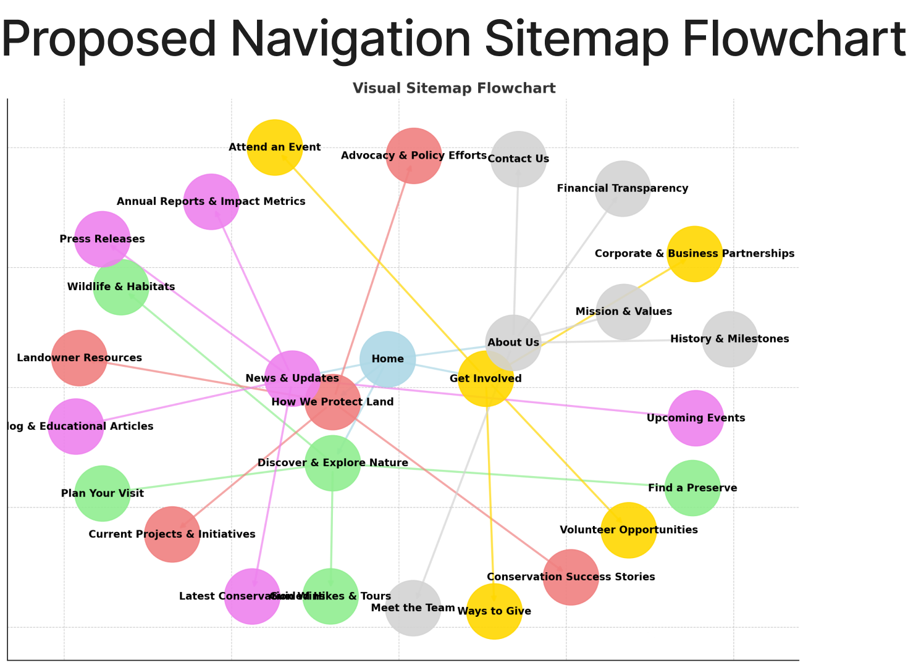

# — Website Content Strategy and Migration Plan

[  —— 🔭 **Overview – Website Strategy (2025)**](website-content-strategy-and-migration-plan/—— 🔭 Overview – Website Strategy (2025)%201fa2a8cd57558029a31bf0e098184bc6.md)

[Untitled](website-content-strategy-and-migration-plan/untitled.csv)

🧭 **About This Page**

This page guides the content strategy, page structure, and migration process for the redesigned Door County Land Trust website.

Use this document to:

- Align website content with engagement and fundraising goals
- Coordinate messaging, tone, and structure across teams
- Track page creation, authorship, and publication workflow

📌 Linked below: [Content Briefs] for specific pages and sections.

### **🎯 PURPOSE**

Define and guide content creation and structure for the redesigned Door County Land Trust website in support of:

- Audience-specific engagement
- Mission-centered storytelling
- Strategic calls to action
- Long-term stewardship and fundraising outcomes

---

### **🧱 FOUNDATIONS**

**Primary Goals**

- Convert passive visitors into supporters (donors, members, volunteers)
- Inspire deeper connection with the land (visits, stories, social shares)
- Reduce friction in content discovery and engagement
- Create a scalable, future-proof content system

**Core Audiences**

(Reference: [Audience Segmentation](../../1 STRATEGY 1e52a8cd575580f09c07e3a0026d2c12/comms-strategy-master-hub/audience-segmentation-messaging-strategy.md))

- 🧓 Retiree Conservationists
- 👨‍👩‍👧‍👦 Visiting Families
- 🥾 Young Outdoor Seekers
- 🧑‍🌾 Local Land Donors and Volunteers

**Messaging Themes**

(Reference: [Messaging Library](../../3 REFERENCE & TOOLS 1e52a8cd575580c7a886f4de373f194d/messaging-library.md))

- Stewardship as a journey
- Protect what you love
- Legacy and community impact
- Celebrate nature’s resilience

---

### **🗺️ CONTENT ARCHITECTURE**

🖼️ **Proposed Navigation Flowchart**

This visual represents a mid-level sitemap and user flow concept. Color-coded clusters correspond to major content themes: engagement, conservation, giving, storytelling, etc.

**Sitemap (Draft)**

- Home
- Explore Our Lands
- Our Work (Land Protection, Stewardship)
- Get Involved (Volunteer, Donate, Events)
- Stories
- About
- Contact

**Content Pillars**

- 🏞️ Protecting Land
- 🧭 Exploring Nature
- 💬 Sharing Impact
- 💚 Giving and Involvement

**Page Briefs**

*(Link to shared folder or add toggle sections here with key content & CTA goals per page)*

---

### **🧠 MESSAGING STRATEGY**

**Milestone Framework**

(From Comms Training: Awareness → Engagement → Support → Advocacy → Legacy)

**Story Formats**

- Preserve Spotlights
- Member Testimonials
- Project Milestones
- Staff & Volunteer Voices

**Tone and Voice**

- Clear, inspiring, not overly technical
- Grounded in place and people
- Avoid clichés; speak with warmth and clarity
- Use active verbs and nature-based language

---

### **🔄 EDITORIAL PROCESS**

**Workflow**

- Page Owner Assigned
- Content Drafted
- Peer Review
- Final Approval
- Upload to WordPress

**Roles**

- Content Strategist: [Name]
- Page Authors: [List of responsible people per section]
- Reviewer: [ED, Board, or Communications Lead]

**Content Guidelines**

- Max reading level: Grade 8
- Alt text for all images
- Headlines: Verb + Benefit
- Paragraphs: 2–4 sentences max
- CTAs: One clear action per page

---

### **📈 ENGAGEMENT PLAN**

**Key Metrics**

- Top entry pages
- CTA clickthroughs (donate, visit, sign up)
- Time on page
- Bounce rate by section
- Engagement per persona (if tracked)

**SEO/Findability**

- Alt text compliance
- Meta titles/descriptions
- Keyword targets per page/topic

**Testing Plan**

- Homepage hero message A/B
- CTA button placement
- Impact story length vs. clicks

[—— Content Briefs](website-content-strategy-and-migration-plan/content-briefs.md)

[—— Staff Interviews & Departmental Input](website-content-strategy-and-migration-plan/staff-interviews-departmental-input.md)

[**——  DCLT Website & Communications Alignment**](website-content-strategy-and-migration-plan/—— DCLT Website & Communications Alignment 2022a8cd57558054bd4feaacc01a70ce.md)

[—— Content Types & Modeling](website-content-strategy-and-migration-plan/—— Content Types & Modeling 1f12a8cd575580139cabe8ef5f76b4bc.md)

[—— Modular Content Blocks](website-content-strategy-and-migration-plan/modular-content-blocks.md)

[—— Information Architecture](website-content-strategy-and-migration-plan/information-architecture.md)

[—— Wireframes - DCLT Website Redesign](website-content-strategy-and-migration-plan/wireframes-dclt-website-redesign.md)

[  —— Evergreen Content Series Tracker](website-content-strategy-and-migration-plan/—— Evergreen Content Series Tracker 2302a8cd575580b2a6a2ca3a055ce0f8.md)