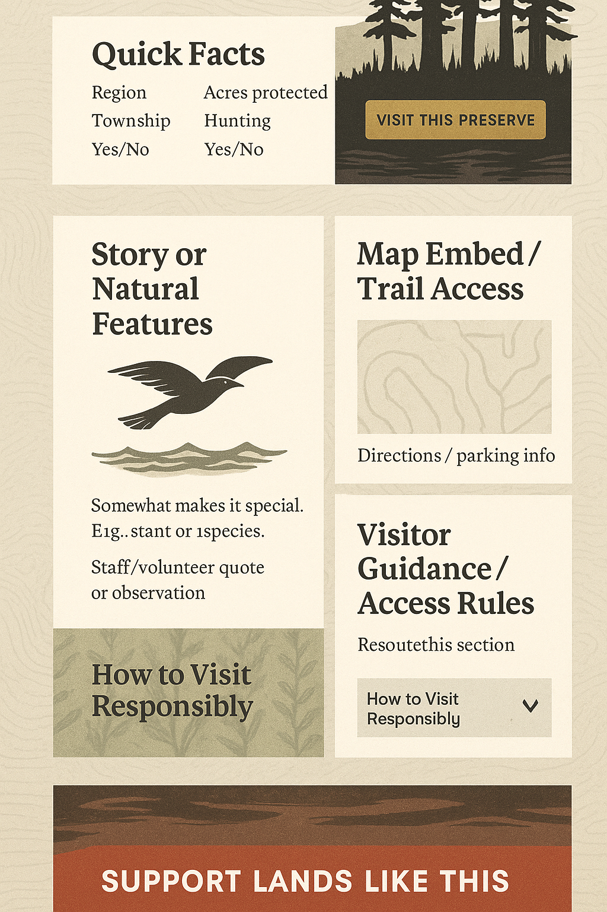

# —— Preserve Detail

### **🖼️ Hero Section**

- Preserve name
- Short location descriptor (e.g. “Near Egg Harbor”)
- Hero image
- CTA Button: “Visit This Preserve” / “Map & Directions” / “View on AllTrails”

---

### **📌 Quick Facts Block**

- Township / Region
- Acres protected
- Trail length (mi/km)
- Hunting allowed: ✅ / ❌
- Accessibility status: ✅ / ❌

---

### **🗺️ Map + Access**

- Embedded map OR AllTrails link
- Parking instructions
- Coordinates or Google Maps integration

---

### **🌿 Natural Features or Story Block**

- What makes it ecologically significant or unique?
- Species supported (e.g. monarchs, orchids, karst features)
- Short paragraph or story with image
- Optional: quote from staff/volunteer

---

### **🚶 Visitor Guidance**

- Trail rules and etiquette
- Preserve vs. Natural Area (if needed)
- Toggle FAQ: “Can I bring my dog?” / “Are there restrooms?” / “Is this wheelchair accessible?”

---

### **🤝 Get Involved / Call to Action**

- “Love this place?” → Volunteer / Donate CTA
- Membership tier or seasonal campaign (if applicable)

---

### **🖼️ Photos & Downloads**

- Photo gallery (static or carousel)
- Downloadable preserve map PDF

---

### **🔁 Related Preserves**

- “You might also enjoy…” with 2–3 nearby or similar locations